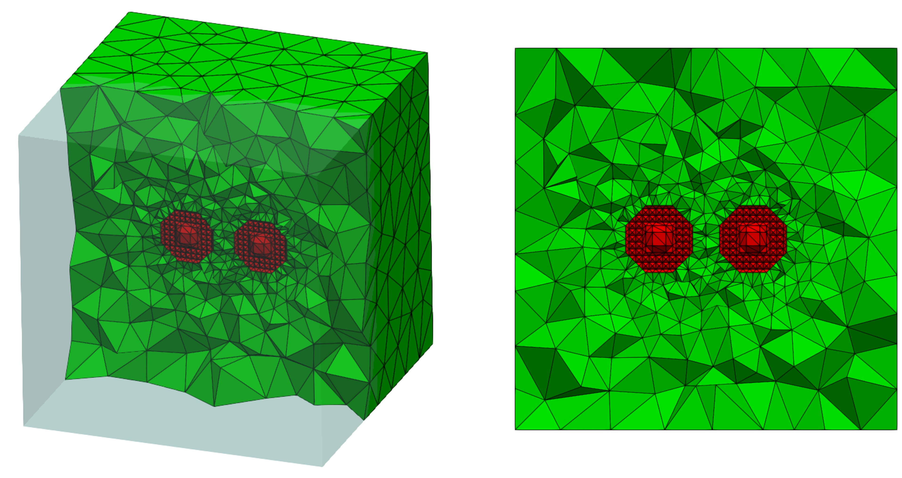

<!--
 * @Author: Kejie Fu
 * @Date: 2023-03-11 23:20:09
 * @LastEditTime: 2023-04-21 22:11:12
 * @LastEditors: Kejie Fu
 * @Description: 
 * @FilePath: /MeshAC/README.md
-->

# MeshAC

A 3D Mesh Generation and Adaptation Package for Multiscale (atomistic-to-continuum) Coupling Simulation for Materials Defects. Written by Kejie Fu, Mingjie Liao and Yangshuai Wang.



## Getting Started
### Installation

You can install MeshAC with the following steps:
- Clone the repository into your local machine:

```bash
git clone https://github.com/kjfu/MeshAC.git
```

- Compile the code using cmake:
  
```bash
cd MeshAC
mkdir build
cd build
cmake ..
make
```
### Command Line Switches

MeshAC supports usage via command line. Here is an overview of all command line switches:

```
Usage: ./MeshAC [OPTIONS] input [output]

Postionals:
	input TEXT REQUIRED     Input a file of initial mesh(.mesh) for mesh generation or middle files
				(.mesh, .remesh and .value) for mesh adaptation.(string, required)
	output TEXT             Output a file of resulting mesh (.mesh) or a file of interpolation solutions
				(.value).

Options:
	-h			Print this help message and exit.
	-i TEXT REQUIRED        Input a file of initial mesh(.mesh) for mesh generation or middle files
				(.mesh, .remesh and .value) for mesh adaptation.(string, required)
	-o TEXT                 Output a file of resulting mesh (.mesh) or a file of interpolation solutions
				(.value).
	-s  FLOAT               Input the max sizing value for mesh generation.
	-hd                     Generate a mesh with edge dislocation.
	-r                      Refine an existing mesh adaptively.
	-rr                     Refine an existing mesh with edge dislocation adaptively.
```
### Examples
#### To generate 3d mesh from points（with 8 points as bounding points with label 1, and several atomistic points with label 0）
```
>> ./MeshAC -s 5 -i sample.mesh -o outmesh.mesh
```
#### To generate a 3d mesh from points with edge dislocation

```
>>./MeshAC -hd -i test3d.mesh -s 15 -o out3d.mesh
````

#### To remesh a 3d mesh adaptively
You must keep 3 files (*.mesh, *.remesh, *.value) in same path.
```
>>./MeshAC -r -i test3d -o out3d
```

#### To remesh a 3d mesh with edge dislocation adaptively
You must keep 3 files(*.mesh, *.remesh, and *.value) in same path 
```
>>./MeshAC -rr -i test3d -o out3d
```

### Labels Meanings in .mesh file

#### Labels for nodes

| Label | Significance |Tip|
|:------|:-------|:-----|
|0|Nodes inside the atomic area||
|1|Nodes on the border of the continuous area||
|2|Nodes on the border of the atomic area||
|3|Nodes between the border of the continuous area and the border of the atomic area||
#### Labels for tets

| Label | Significance |Tip|
|:------|:-------|:-----|
|0|Tets of the atomic area||
|1|Tets of the continuous area||


## Overview

We now summarize the main components of the library. 

1. Mesh generation

2. Mesh adaptation

3. ...

The following functionals are currently supported:
- [`...`](...) ....

From Mesher3DForSJTU package ...

## A/C coupling method in Julia

Atomistic-to-continuum coupling method in Julia. The current implementation is based on the [BGFC (Blended Ghost Force Correction)](https://epubs.siam.org/doi/10.1137/15M1020241) method.

The atomistic computations involved are heavily depends on the pure Julia package [JuLIP](https://github.com/JuliaMolSim/JuLIP.jl) (Julia Library for Interatomic Potentials).

1. Install Julia 1.8.5 from [here](https://julialang.org/downloads/); 
2. Run the following Julia commands step by step:
```
using Pkg; 
] registry add https://github.com/JuliaRegistries/General"; 
] registry add https://github.com/ACEsuit/ACEregistry"; 
] add JuLIP, DelimitedFiles, Printf, NeighbourLists, QHull, Optim, LineSearches, SparseArrays, nsoli, PyCall
```

Tips:
1. Use ```Pkg.activate(".")``` to use a local project and set environment variable ```JULIA_PROJECT``` accordingly. 
2. Please do remember to modify the path of mesher3d in AtC constructor (AtC.jl).

### FIO

The module named `ACFIO` is used to cope with the geometrical operations.

The functionals of FIO are to read/write:   

- .mesh
- .remesh   
- .value   

and write .dump files for visualization.

Example:

```julia
fn = "a.mesh"
# X: atom positions and outer continuum points; Xtype: interface information
ACFIO.write_mesh(fn, X, Xtype)
# call `mesher3d` to build coupled mesh
ofn = "ac.mesh"
run(`$meshpath -s $h -hh $fn -o $ofn`)
# X: nodes; T: mesh topology
X, T = ACFIO.read_mesh(ofn)
```

### AtC

Major struct contains geometrical and computational information.

To construct an AtC objective invokes:   
```
function AtC(Ra::Int64, bw::Int64, Lmsh, h; Rbuf=2, sp=:W, r0=rnn(:W), defects=:SingVac, meshpath="YOUR PATH")
```
Note that `meshpath` is the path of mesher toolkit that may differ from each devices.

Example:

```julia
# construct atomistic region with defects. R: radius; 
atdef = get_atdef(R)
# construct a/c coupling structure. h: mesh size; L: size of computational domain
atc0 = AtC_di(atdef, h, L)
```

### Adaptive

Solve $\to$ Estimate $\to$ Mark $\to$ Refine

1. Solve

`src/AtC` + `src/Solve`: We use `minimise!` which is based on the implementation of `JuLIP.Solve` and `nsoli` as well.

2. Estimate

$\|\nabla u\|_{L^2(T)}$ for all $T\in\mathcal{T}$, where $\mathcal{T}$ is constructed by `ACFIO` part.

3. Mark

- Tetrahedral elements' indices.   
- Appending points' positions.

4. Refine

Call `mesher3d -r`, see `./src/adaptive.jl` for more details.

This refinement functional requires \*.mesh, \*.remash, and \*.value files in the same path.

- \*.mesh: original mesh files to be refined.
- \*.remesh: consists of two fields labeled with
	- Append\_points: vectors represent atomistic points to be appened adjacent to the interface.   
	- Refine_elements: indices of elements to be refined.
- \*.value: consists of two fileds labeled with (could be used individually)
	- scalar density
	- vector displacement

Example:
```julia
include("./examples/test_adaptive.jl")
```

## Development


MeshAC is under active development. Please don't hesitate to open feature requests to help us guide development. We more than welcome contributions!

## Publications

MeshAC has been used in the following publications.

1. [Adaptive Multigrid Strategy for Geometry Optimization of Large-Scale Three Dimensional Molecular Mechanics (J. Comp. Phys. 2023)](https://www.sciencedirect.com/science/article/pii/S0021999123002085)<br> K. Fu, M. Liao, Y. Wang, J. Chen and L. Zhang

## Citation

If you use the codes in a publication, please cite the repo using the .bib,

```
@inproceedings{...,
 author = {...},
 booktitle = {...},
 publisher = {...},
 title = {...},
 url = {...},
 volume = {...},
 year = {...}
}
```
